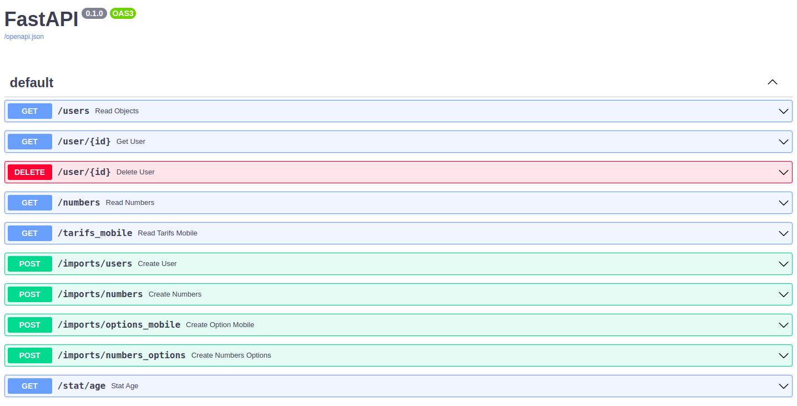

# Operator
- stack
`python FastApi SQLAlchemy PosgeSQL`
- to run
  `uvicorn main:app --reload`
## Description
- веб-сервис мобильного оператора. Созданы таблицы пользователей, номеров телефонов, тарифов, опций.
- Документация находится по адресу `http://127.0.0.1:8000/docs`
- Описание запросов:
  - GET/users - отдаёт информацию о всех пользователей. Для каждого составляет список номеров, зарегистраированных на этого пользователя. Отдаёт сколько пользователь платит в месяц с учётом тарифа и опций для каждого номера.
  - GET/user/id - отдаёт информацию о пользователе
  - DELETE/user/id -удаляет пользователя
  - GET/numbers - отдаёт список всех номеров с указанием тарифа и пользователя(владельца) номера
  - GET/tarifs_mobile - отдаёт список тарифов с их описанием
  - POST/imports/users - загружает пользователей
  - POST/imports/numbers - загружает номера
  - POST/imports/options_mobile - загружает опции
  - POST/imports/numbers_options - загружает связи номер-опция
  - GET/stat/age - отдаёт статистику по возрастам пользования тем или иным тарифом
- Описание архитектуры базы данных:
   - Один пользователь может иметь сколько угодно номеров
   - Каждый номер имеет один определённый тариф
   - Каждый номер может иметь сколько угодно опций

